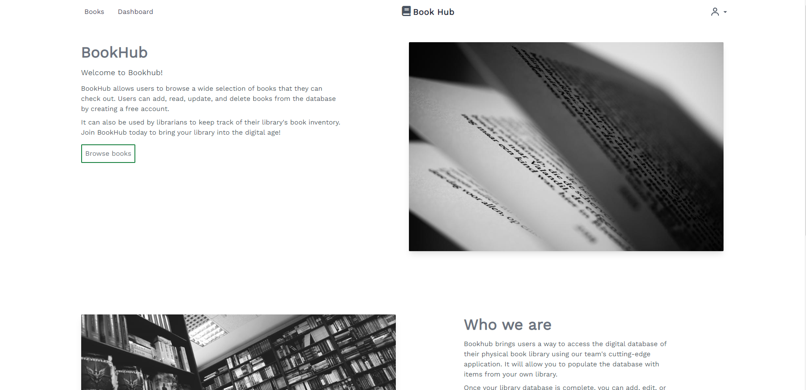
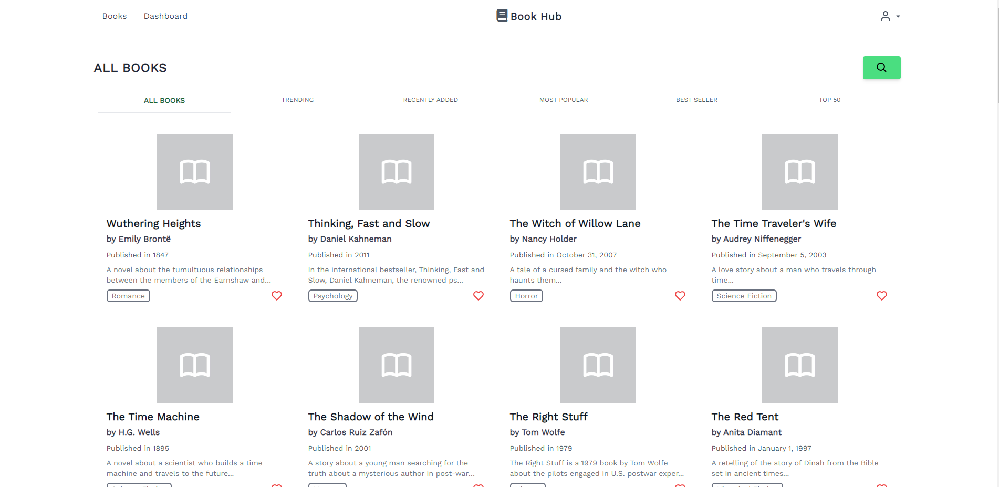

# BookHub




## Description

BookHub is Node.js app that allows users to view books stored in our book database. Users can add to their reading list or just browse a variety of different books.

## User Stories

- [x] User can search the database for a wide variety of books
- [x] User can view different genres and categories of books such as trending, most popular, best seller,
- [x] User can sign up and login
- [x] User can add, update, and delete new books
- [x] Only authenticated managers can add and delete books from the database.

## Technologies Used

- Node.js
- Express.js
- Handlebars
- TailwindCSS

## Usage

- View all books at `/books/`
- Navigate to the dashboard to add new books
- create a free account to have access to the dashboard

## Contributors

[Darius Garcia](https://github.com/dariusgarcia/)

[Nate](https://github.com/ndifiori)

[Aaron Wilson](https://github.com/a-wilson-96)

[Daniel Yang](https://github.com/danielshang11)

## Installation

clone the repo to local machine

```
cd bookhub/
```

Install dependencies

```
npm install
```

Add your own env variables to connect to SQL db.

```
bookhub/.env
```

Seed the database with data

```
npm run seed
```

start express server

```
nodemon server.js
```
